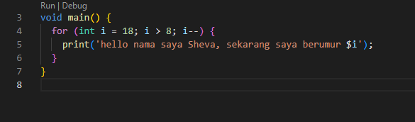
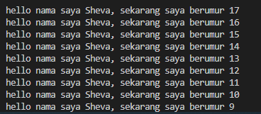

7. Tugas Praktikum

Nama : Sheva Ananda Arifiansyah

NIM : 2241760114

Kelas : 3E

# Soal 1
Modifikasilah kode pada baris 3 di VS Code atau Editor Code favorit Anda berikut ini agar mendapatkan keluaran (output) sesuai yang diminta!

hasil modif

# Soal 2
Mengapa sangat penting untuk memahami bahasa pemrograman Dart sebelum kita menggunakan framework Flutter ? Jelaskan!
- Karena Dart adalah bahasa utama yang digunakan untuk menulis kode di Fluttet Dart, termasuk pembuatan UI, dan logika aplikasi. sintaks dan struktur kode Dart, seperti variabel, tipe data, kontrol alur, serta konsep pemrograman berorientasi objek (OOP). Dart juga memiliki pendekatan khusus untuk pemrograman asinkron menggunakan Future, async, dan await, yang penting dalam mengelola operasi jaringan dan animasi. standar Dart seperti List, Map, dan Set membantu pengelolaan data dengan efisien, dan pemahaman yang baik tentang Dart mempermudah proses debugging dan pemeliharaan kode.  

# Soal 3
Rangkumlah materi dari codelab ini menjadi poin-poin penting yang dapat Anda gunakan untuk membantu proses pengembangan aplikasi mobile menggunakan framework Flutter
- Program Dart
Tujuan: Menggabungkan bahasa modern dengan fitur terkini seperti tooling produktif, garbage collection, dan type safety. Peran dalam Flutter: Dart adalah bahasa utama untuk pengembangan aplikasi, plugin, dan manajemen dependensi di Flutter.
- Evolusi Dart
Sejarah: Diluncurkan pada 2011, dengan fokus awal untuk menggantikan JavaScript, kemudian beralih ke pengembangan mobile melalui Flutter. Perubahan Utama: Versi 2.0 pada 2018 memperkenalkan fitur-fitur penting untuk performa dan alat yang lebih baik.
- Cara Kerja Dart
Eksekusi Kode: Kode Dart dapat dijalankan melalui Dart Virtual Machine (VM) atau dikompilasi menjadi JavaScript. Kompilasi: JIT (Just-In-Time) untuk pengembangan dan hot reload, AOT (Ahead-Of-Time) untuk performa aplikasi produksi.
- Struktur Bahasa Dart
Sintaks: Mirip dengan bahasa lain seperti C dan JavaScript. Pemrograman Berorientasi Objek (OOP): Mendukung fitur seperti enkapsulasi, pewarisan, dan polimorfisme. Operator: Termasuk operator aritmatika, penambahan/pengurangan, persamaan/relasional, dan logika.