# 2. Praktikum 1: Menerapkan Control Flows ("if/else")

Nama : Sheva Ananda A

Nim : 2241760114

Kelas : 3E

# Langkah 1:
Ketik atau salin kode program berikut ke dalam fungsi main().

String test = "test2";
if (test == "test1") {
   print("Test1");
} else If (test == "test2") {
   print("Test2");
} Else {
   print("Something else");
}

if (test == "test2") print("Test2 again");

run : 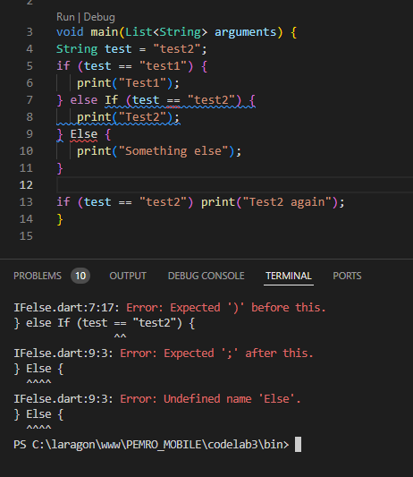

modifikasi 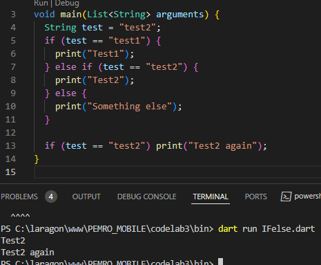

2. Tambahkan kode program berikut, lalu coba eksekusi (Run) kode Anda. Apa yang terjadi ? Jika terjadi error, silakan perbaiki namun tetap menggunakan if/else.
    String test = "true";
    if (test) {
    print("Kebenaran");
    }
- akan error 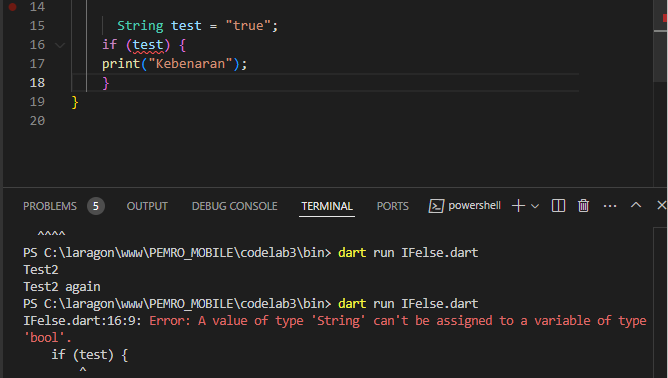
- modifikasi 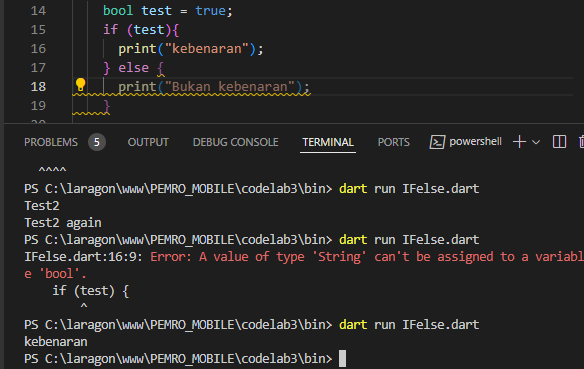

# PRATIKUM 2 Menerapkan Perulangan "while" dan "do-while"
1. Ketik atau salin kode program berikut ke dalam fungsi main(). Silakan coba eksekusi (Run) kode pada langkah 1 tersebut. Apa yang terjadi? Jelaskan! Lalu perbaiki jika terjadi error.
    while (counter < 33) {
    print(counter);
    counter++;
    }  

- run akan error 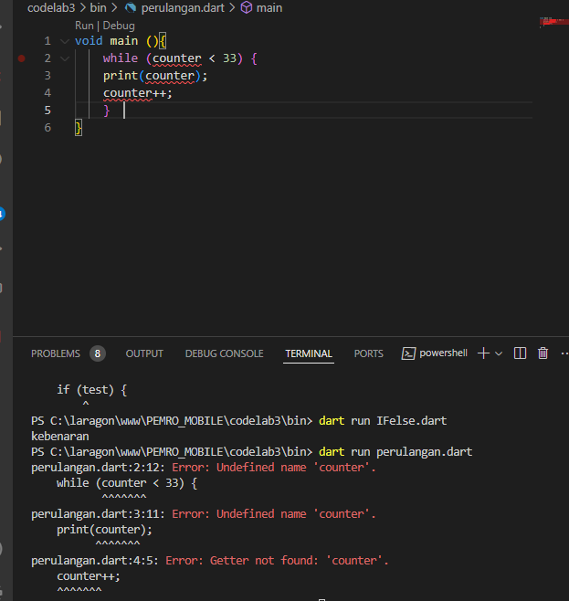
- modifikasi 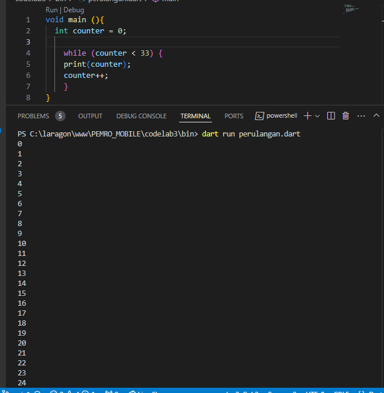

2. Tambahkan kode program berikut, lalu coba eksekusi (Run) kode Anda. Apa yang terjadi ? Jika terjadi error, silakan perbaiki namun tetap menggunakan do-while.
  Langkah 3:
Tambahkan kode program berikut, lalu coba eksekusi (Run) kode Anda.

do {
  print(counter);
  counter++;
} while (counter < 77);
- run 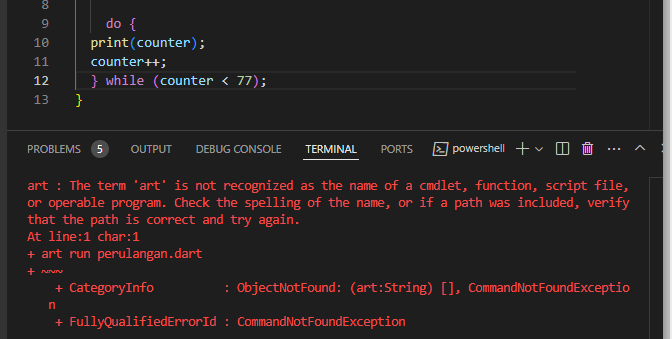
- modif 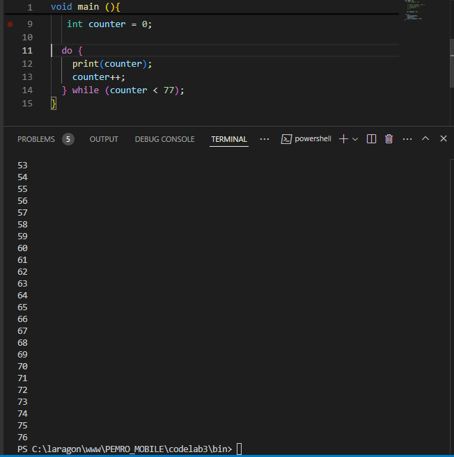

# 4. Praktikum 3: Menerapkan Perulangan "for" dan "break-continue"
Selesaikan langkah-langkah praktikum berikut ini menggunakan DartPad di browser Anda.

Langkah 1:
Ketik atau salin kode program berikut ke dalam fungsi main().

for (Index = 10; index < 27; index) {
  print(Index);
}
- run error 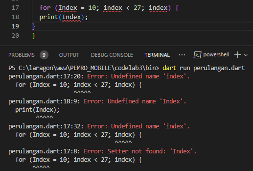
- modifikasi 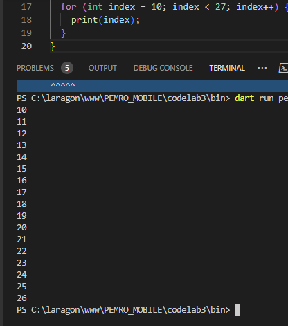
Langkah 2:
Silakan coba eksekusi (Run) kode pada langkah 1 tersebut. Apa yang terjadi? Jelaskan! Lalu perbaiki jika terjadi error.

Langkah 3:
Tambahkan kode program berikut di dalam for-loop, lalu coba eksekusi (Run) kode Anda.

If (Index == 21) break;
Else If (index > 1 || index < 7) continue;
print(index);
Apa yang terjadi ? Jika terjadi error, silakan perbaiki namun tetap menggunakan for dan break-continue.

- run error 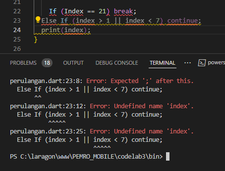
- hasil modifikasi 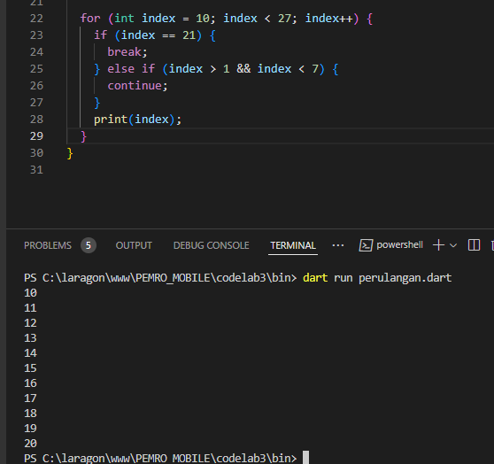

# 5. Tugas Praktikum
1. Silakan selesaikan Praktikum 1 sampai 3, lalu dokumentasikan berupa screenshot hasil pekerjaan beserta penjelasannya!
2. Buatlah sebuah program yang dapat menampilkan bilangan prima dari angka 0 sampai 201 menggunakan Dart. Ketika bilangan prima ditemukan, maka tampilkan nama lengkap dan NIM Anda.
- hasil dart 

- hasil run 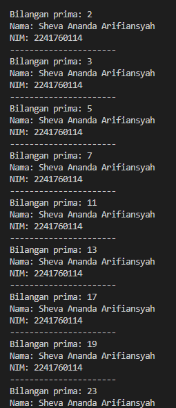
3. Kumpulkan berupa link commit repo GitHub pada tautan yang telah disediakan di grup Telegram!